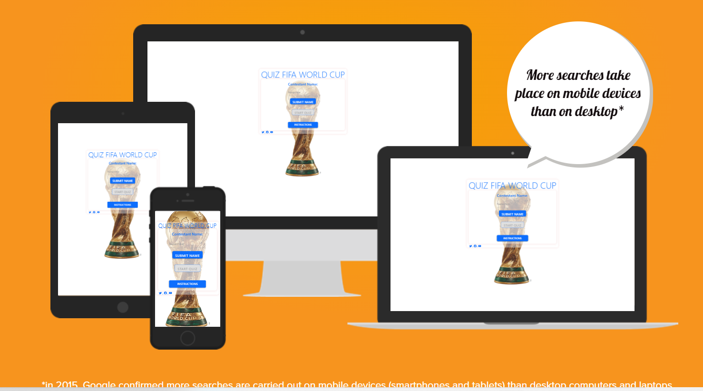

# TABLE OF CONTENT

1. <a href ="#about-this-website">ABOUT THIS WEBSITE</a>

2. <a href ="#features">FEATURES</a>

    <a href ="#front-page">Front Page</a>

    <a href ="#quiz-pages">Quiz Pages</a>

    <a href ="#future-features">Future Features</a>

3. <a href ="#testing">TESTING</a>

    <a href ="#lighthouse-testing">Lighthouse Testing</a>

    <a href ="#validator-testing">Validator Testing</a>

    <a href ="#responsiveness-test">Responsiveness Test</a>

    <a href ="#browser-compatibility">Browser Compatibility</a>

    <a href ="#fixed-bugs">Fixed Bugs</a>

4. <a href ="#technologies-used">TECHNOLOGIES USED</a>

5. <a href ="#deployment">DEPLOYMENT</a>

    

6. <a href ="#credit">CREDIT</a>

    <a href ="#content">Content</a>

    <a href ="#footer">Footer</a>

7. <a href ="#acknowledgement">ACKNOWLEDGEMENT</a>

---

---

# QUIZ - FIFA WORLD CUP

## ABOUT THIS WEBSITE

This website is an interactive quiz for users to score themselves on their knowledge of the FIFA World Cup. There are only 12 historic questions, with each question have 2 wrong answers and 1 correct answer. Upon completion of the quiz, there is a submit button which returns the the users' score out of a possible 12 points.  

Here is the link to the website: [QUIZ - FIFA WORLD CUP]( https://yemoalakija.github.io/QUIZ-FIFA-WORLD-CUP/)

## FEATURES

The website is very user friendly and responsive with high quality HTML, CSS and JavaScript features. These features enable the user to comfortably access the quiz using all devices including mobile, ipads, laptops and desktops computers. 

#### 1. Front Page

The Front Page of this website has a backgroung photo of The FIFA World Cup and it's interactive for the site user to input USERNAME, START the quiz and get information about the quiz from the INSTURCTION button. 
This page also has a footer section at the bottom. These socia media links including Youtube, Twitter and Facebook. Here users can watch some great World Cup goals.

#### 1. Quiz Pages

After clicking the "START QUIZ" button, the next page opens up to start the quiz. The player can start playing the quiz and will receive quiz-results at the end. There is also a "Back-Home" button to return to the Front Page or Start. 

### Future Features

Additional features in the near future shall include more quiz on the just-concluded FIFA World Cup 2022 hosted by Qatar. 

## TESTING

This website was tested using Lighthouse Testing and Validator Testing. 

### Lighthouse Testing

As shown in the picture below, this website passes all criteria including Performance, Accessibility, Best Practices and SEO. 

### Validator Testing 

- HTML
There were no errors found as seen here: [Validator W3](https://validator.w3.org/nu/?doc=https%3A%2F%2Fyemoalakija.github.io%2FQUIZ-FIFA-WORLD-CUP%2F)

- CSS (Jigsaw validator)
There were no errors found as seen here: [Jigsaw W3](https://jigsaw.w3.org/css-validator/validator)

### Responsiveness Test

The responsive design tests were carried out manually with [Google Chrome DevTools](https://developer.chrome.com/docs/devtools/) and [Responsive Design Checker](https://www.responsivedesignchecker.com/). 
The following devices were all tested and passed: Desktop 15-24", Galaxy S5-S7, Galaxy A, iPhone 3-7, Sony Z2-Z3, iPad and iPad Mini

### Browser Compatibility

This website was succcesfully tested on the following browsers and there no errors found. Google Chrome, Microsoft Edge and Mozilla Firefox. Responsiveness were consistent on all above mentioned browsers and devices.

### Fixed Bugs

????????????????????????????

## TECHNOLOGIES USED

- HTML5 - provides the structure and content for the website.
- CSS - provides the styling for the website.
- Javascript - provides user interactivity on the website.
- Gitpod - used for deployment the website.
- Github - used for hosting and editing the website.

## DEPLOYMENT

The website was deployed to GitHub pages. The steps to deploy are as follows:

- Enter the GitHub repository and navigate to the Settings tab
- In the source section, select the Master Branch

Here is the live link: - [QUIZ - FIFA WORLD CUP]( https://yemoalakija.github.io/QUIZ-FIFA-WORLD-CUP/)

### How to create a local clone of this project

Acces Github and follow below instructions:

- STEP 1 - Click on the code tab, under repository name. 
- STEP 2 - Click on the clipboard icon to copy URL. 
- STEP 3 - Open Git Bash in your chosen IDE. 
- STEP 4 - Change clone directory location.
- STEP 5 - Type git clone, and then paste the URL copied from GitHub.

## CREDIT

- Code Institute course modules 

- [W3Schools](https://www.w3schools.com/). This was used for general coding know-how. 

- [stackoverflow](https://stackoverflow.com). This was used for general coding know-how. 

- [CSSColorExtractor](http://www.css-color-extractor.com/). For website color theme. 

Specific contents and media (including photos and videos) were sourced from various websites as referenced below at the clickable links: 

#### Content

- [Kwizzbit](https://kwizzbit.com/fifa-world-cup-quiz-questions-and-answers/)

- [UNB](https://unb.com.bd/category/Sports/is-the-fifa-football-world-cup-trophy-made-of-solid-gold/103291)

- [WorldFlags Direct](https://www.worldflagsdirect.com/worldcup2022.html)

- [Teachwire](https://www.teachwire.net/news/fifa-world-cup-football-lesson-plans-resources-ideas/)

- [Wikipedia](https://en.m.wikipedia.org/wiki/File:FIFA_logo_without_slogan.svg)

- [Bootstrap](https://getbootstrap.com/)

- [Favicon](https://favicon.io/)

- [Cloud Flare](https://www.cloudflare.com/)

#### Footer 

The footer is benefit the Front Page and has clickable social media icons links including Youtube, Twitter and Facebook. These all open external pages for the user to enjoying watching some great World Cup goals. 

- [Youtube](https://www.youtube.com/watch?v=0zIdoBvkiRk) - 10 of the best goals from the 2022 World Cup | ITV Sport

- [Twitter](https://mobile.twitter.com/i/events/1596100698092888065) - Best of the 2022 FIFA World Cup Group Stage (Part 2)

- [Facebook](https://www.facebook.com/watch/?v=1196866764271036) - An incredible and unforgettable goal 🇦🇷 #FIFAWorldCup | #Qatar2022

## ACKNOWLEDGEMENT 

This website was completed in accordance with the criteria for Portfolio 2 Project of The Full Stack Software Developer Diploma at the Code Institute. My special gratitude goes to everyone that has made this project successful including my mentor Precious Ijege, the Slack community and the entire Code Institute for their support and assistance. 

